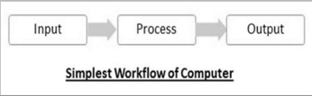
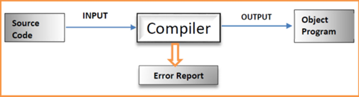
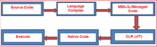

# ****💻 01 - Introduction and Basics****


#### *In this folder, we will discuss the fundamentals of computer programming, the .NET framework, and the basics of C# programming.*


## 1. Computer Concepts:

 * **Computer** → is an electronic device that receives input, stores or process the the input as per user instruction and provides output in desired format.
	
	
	
 * **Computer System** →  is a set of devices including computer and 
other related devices like input/output devices, which make 
computer to function.
	
* There are two major types of computer components: **Hardware 
and Software**:

* **Computer Hardware** → Any physical device used in machine (like monitro, speaker, keyboard.....).

* **Computer Software** → Set of instructions, stored in computer memory which tell computer what to do. (Stored digitally)

* **Console** → is generally an interface (text-based or graphical) that 
allows direct interaction with a computer system.

* **Computer Program** → is a sequence of instructions written using a 
Computer Programming Language to perform a specified task by 
the computer. (It is a finished product)

* **Computer Programming** → is the process of writing, designing, testing, and 
fixing computer programs. (It is not a finished product)

* **Source Code** → is a set of instructions written by the programmer in a programming language.

* **Compiler** → is a computer program (or set of programs) that transforms source code written in a programming language into another computer language.

  →Compiler either translates all program into machine language or produces error report.

	

* **Interpreter** → is a software that reads one instruction from source code written in high level language, at a time, translates it in machine language, executes it and then proceeds to next instruction.

* **Debugger** → is a tool that helps programmers find and fix errorsin a program.

* **For Simple illustration, if you have a book and you need 
translate a book into another language**:
1. Compiler= Translate an entire book before reading.
2. Interpreter = Translate sentence by sentence while reading. 
3. Debugger= A detective that finds the mistakes inside the book.

## 2. Network Enabled Technology (.NET Framework):

* **.NET** → is a Free, Cross-Platform, Open-Source developer platform for building many different types of applications.

* **Framework** → is a software. Or you can say a framework is a collection of many small technologies integrated together to develop applications that can be executed anywhere.

* **.NET Framework** → is used to create and run software applications.
* **.NET Framework applications** → are developed using C#, F#, or VB Programming Language and compiled into Common Intermediate Language (CIL) or MSIL (Microsoft Intermediate Language). The Common Language Runtime (CLR) runs .NET applications on a given machine, converting the CIL code or MSIL code to machine code that the corresponding machine can execute.

 
 
## 3. C# :

* **C#** → it is an object-oriented programming language created by Microsoft that runs on the .NET Framework and has roots from the C family, and the language is close to other popular languages like C++ and Java.


#### *C# Syntax* :

```csharp  

using System;

namespace HelloWorld

{

  class Program

   {
 
       static void Main(string\[] args)

       {

         Console.WriteLine("Hello World!");

       }

   }

}

