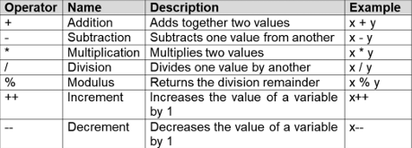
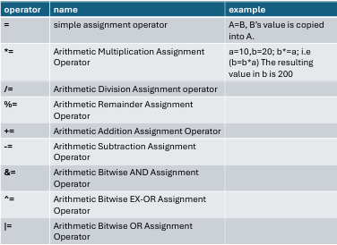
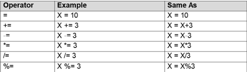
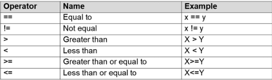
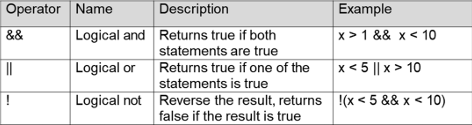
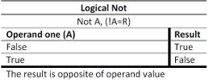
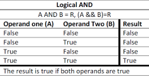
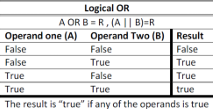
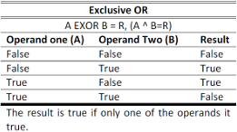

# ****💻 03 - Operators and Control Structures****

### *In this folder, we will explore how to perform operations on variables and how to control the flow of our program using decision-making structures.*
---
## 1. Operators in C#:
Operators are special symbols used to perform operations on variables and values.

* **Arithmetic Operators** → Used to perform common mathematical operations.
  * `+` (Addition)
  * `-` (Subtraction)
  * `*` (Multiplication)
  * `/` (Division)
  * `%` (Modulus/Remainder)
  * `++` (Increment: increases value by 1)
  * `--` (Decrement: decreases value by 1)
  
  

* **Assignment Operators** → Used to assign values to variables.
  * `=` (Simple assignment, e.g., `x = 5`)
  * `+=` (Addition assignment, e.g., `x += 3` is the same as `x = x + 3`)
  * `-=` , `*=` , `/=`

  
  

* **Comparison (Relational) Operators** → Used to compare two values. They always return a boolean value (`true` or `false`).
  * `==` (Equal to)
  * `!=` (Not equal)
  * `>` (Greater than)
  * `<` (Less than)
  * `>=` (Greater than or equal to)
  * `<=` (Less than or equal to)

  

* **Logical Operators** → Used to determine the logic between variables or values.
  * `&&` (Logical AND): Returns true if BOTH statements are true.
  * `||` (Logical OR): Returns true if ONE of the statements is true.
  * `!` (Logical NOT): Reverses the result (returns false if the result is true).

  
  
 



---

## 2. Control Structures (Decision Making):
Control structures allow the program to take different paths based on certain conditions.

### A. If ... Else Statements:
We use `if` to specify a block of C# code to be executed if a condition is `true`.
`else if` used to specify a new condition to test, if the first condition is false. 
We use `else` to specify a block of code to be executed if the condition is `false`.

```csharp
int mark = 70;

if (mark <= 100 && mark > 51) 
{
    Console.WriteLine("Excellent.");
}
else if (mark = 50) 
{
    Console.WriteLine("Good.");
} 
else 
{
    Console.WriteLine("Very low.");
}
// Output: "Excellent."
```
### B. Switch Statement:
Instead of writing many if..else if statements, you can use the switch statement. It selects one of many code blocks to be executed based on a specific value.
Rules for switch:

* The switch expression is evaluated once.
* The value of the expression is compared with the values of each case.
* If there is a match, the associated block of code is executed.
* The break keyword stops the execution of more code inside the switch.
* The default keyword specifies some code to run if there is no case match (like the else statement).

```csharp
Console.Write("Enter a number from 1 to 7: "); 
int day = int.Parse(Console.ReadLine()); 
switch (day) 
{ 
    case 1: 
        Console.WriteLine("Saturday"); 
        break; 
    case 2: 
        Console.WriteLine("Sunday"); 
        break; 
    case 3: 
        Console.WriteLine("Monday"); 
        break; 
    case 4: 
        Console.WriteLine("Tuesday"); 
        break; 
    case 5: 
        Console.WriteLine("Wednesday"); 
        break; 
    case 6: 
        Console.WriteLine("Thursday"); 
        break; 
    case 7: 
        Console.WriteLine("Friday"); 
        break; 
    default: 
        Console.WriteLine("Invalid day"); 
        break; 
}
```